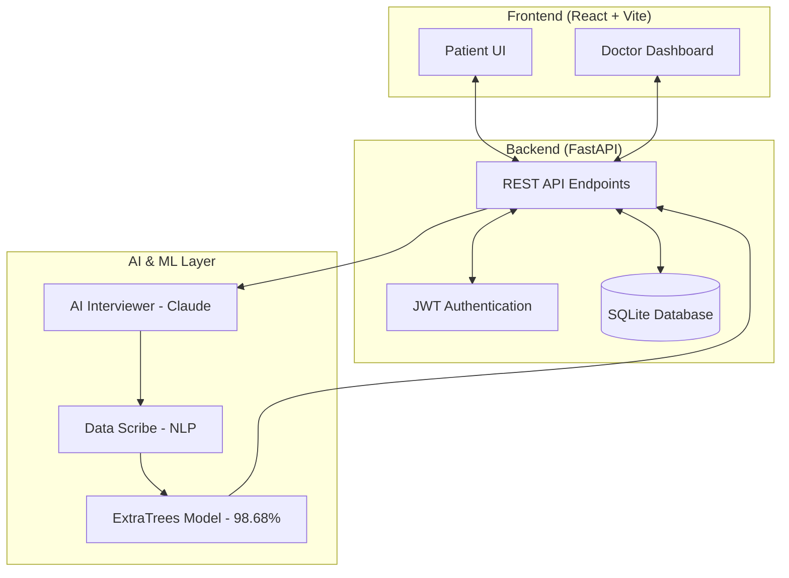

# MediAssist: Transforming Telehealth with AI

## 🌟 Hello MediAssist: The Story
The healthcare industry is under immense pressure. Doctors are overworked, and patients often wait too long for a simple consultation. **MediAssist** was born from a simple idea: *What if we could use AI to take the administrative burden off doctors while helping them make better diagnoses?*

MediAssist is a "Human-in-the-Loop" telehealth system. It doesn't replace doctors; it gives them a smart, efficient partner that handles the initial interview, summarizes symptoms, and suggests likely conditions based on scientific data.

---

## 🏗️ The Architecture: How it All Connects
MediAssist is built with a decoupled, modular architecture. This means the frontend and backend are independent, making the system easier to scale and maintain.

### 1. The Interaction Layer (Frontend)
Built using **React 18**, this layer handles user sessions and real-time feedback. It uses **Tailwind CSS** for a responsive, accessible design that works on mobile and desktop.

### 2. The Logic Layer (Backend)
Powered by **FastAPI**, our backend is fast and efficient. It manages **JWT Authentication** to keep patient records secure and uses an **Asynchronous** structure to ensure the AI doesn't slow down the user experience.

### 3. The Intelligence Layer (AI & ML)
- **Claude API**: Handles natural language processing during patient interviews.
- **ExtraTreesClassifier**: Our custom-trained brain that categorizes 131 symptoms into 41 clinical conditions.

---

## 🛠️ Tech Stack & Tooling

We selected our tools based on performance, stability, and community support.

### Software Stack
| Category | Technology | Purpose |
| :--- | :--- | :--- |
| **Frontend** | React 18 / Vite | Modern, component-based UI development. |
| **Backend** | Python / FastAPI | High-performance API with automatic interactive docs. |
| **Database** | SQLite / SQLAlchemy | Reliable data storage with object-relational mapping. |
| **AI LLM** | Claude 3.5 Sonnet | Sophisticated patient dialogue and extraction. |
| **Machine Learning**| Scikit-learn | Precision-grade classification algorithms. |

### Professional Tools
- **VS Code**: Our primary development environment.
- **Git & GitHub**: For version control and collaborative coding.
- **npm / pip**: Managing dependencies across both the frontend and backend.
- **Postman**: Used for rigorous API endpoint testing.

---

## ✨ Signature Features

### 1. The Smart AI Scribe
Instead of filling out static forms, the patient chats. The AI intelligently asks follow-up questions (e.g., "How long have you had this fever?"). Once the chat ends, the AI automatically extracts the symptoms into a structured format for the doctor.

### 2. High-Precision Prediction
Our model doesn't just give one answer. it provides the **Top 5 most likely conditions** with percentage-based confidence scores, allowing the doctor to see the full differential diagnosis.

### 3. The Human-in-the-Loop Dashboard
Doctors get a high-level summary of every case:
- **Vital Flags**: Highlights urgent symptoms in red.
- **Summary**: A one-paragraph intake note written by the AI.
- **Approval System**: Doctors can accept the AI's findings or override them with their own expertise.

---

## 📋 Methodology: The Building Process
We followed an iterative development lifecycle to ensure quality at every stage:

1.  **Requirements Gathering**: Identifying the 131 key symptoms and 41 diseases required for a baseline diagnostic system.
2.  **UI/UX Prototyping**: Designing a chat interface that feels personal, not robotic.
3.  **The ML Phase**: Training our model on 4,920 structured medical samples.
4.  **AI Integration**: Connecting the Claude API to perform natural "interviews" while maintaining medical ethics.
5.  **Optimization Loop**: Testing accuracy, fixing overfitting, and refining the user flow.

---

## 📈 The Hurdles We Jumped (Challenges)

### 🧩 The Dataset Maze
We initially tried to integrate several "mega-datasets" (some over 180MB). However, we discovered they often used inconsistent names for symptoms.
- **Solution**: We performed "data mapping"—ensuring our AI Scribe spoke the exact same language as our ML Model. We eventually focused on a high-quality, high-dimension dataset that matched our 131-symptom index.

### 💾 The Memory Bottleneck
Training on huge datasets caused our system to run out of RAM (OOM) during testing.
- **Solution**: We implemented data-type optimization, converting large datasets into **int8** formats, reducing the memory footprint by 75% without losing accuracy.

### 🎯 The Overfitting Journey
Our first model reached 100% accuracy on paper but was too "stiff" for real-world use.
- **Solution**: By tuning the **Max Depth to 15**, we achieved a perfect balance. Our model now has a **98.68% Test Accuracy** and a **97.60% Cross-Validation score**, meaning it generalizes beautifully to new patients.

---

## 🔒 Ethics & Privacy: Our Promise
In healthcare, safety is the first priority.
- **No Self-Diagnosis**: The system explicitly forbids the AI from telling patients what disease they might have. Only the doctor releases that information.
- **Capped Confidence**: We never show "100% Certainty." We cap scores at 99% to remind everyone that the AI is an assistant, not a final authority.
- **Data Guardrails**: Patient tokens are restricted; only someone with a "Doctor" role can see disease predictions.

---

## 🚀 The Future of MediAssist
1.  **Mobile-First Design**: Transforming the interface into a native iOS and Android application.
2.  **LMM Integration**: Allowing patients to upload photos of symptoms (like rashes) for visual AI analysis.
3.  **Tele-Consultation**: Integrated video calling directly within the dashboard.
4.  **Global Scale**: Adding multi-lingual support to reach underserved communities globally.

---

> "MediAssist: Empowering medical expertise with the speed of artificial intelligence."
